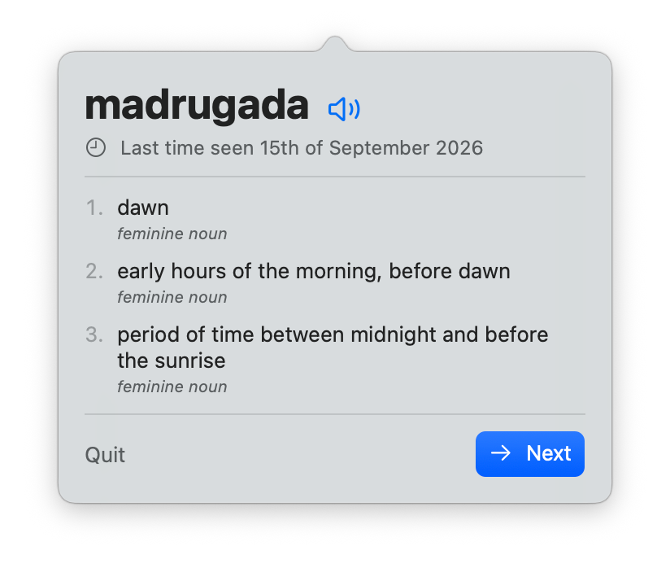

<p align="center">
  
</p>

<h1 align="center">Spanish Menu Bar</h1>

<p align="center">One Spanish word in your Mac menu bar, every 30 minutes.<br>
Click it for the English definition and pronunciation.</p>

<p align="center">
  <a href="https://github.com/hamza221/spanish-menu-bar/releases/latest"><b>Download</b></a> ·
  <a href="https://hamza221.github.io/spanish-menu-bar/">Website</a>
</p>

<p align="center">
  
</p>
<p align="center">
  <picture>
    <source srcset="docs/assets/popover-dark.png" media="(prefers-color-scheme: dark)">
    
  </picture>
</p>

## Features

- **A new word every 30 minutes.** The word sits in the menu bar; click it to see its English definitions and part of speech.
- **Pronunciation.** The speaker button (or <kbd>⌘P</kbd>) reads the word with macOS's built-in Spanish voice. If you download an Enhanced or Premium Spanish voice in *System Settings → Accessibility → Spoken Content*, the app uses it instead.
- **Next.** Press **Next** (or <kbd>↩</kbd>) to get a new word right away.
- **Shuffled, no repeats.** All 29,743 headwords come in random order, and every word is shown once before any word is shown again. When the cycle ends, a new shuffle starts.
- **Only counts when you're there.** A word counts as *seen* only if the Mac was awake, the screen was on and unlocked, and the mouse moved while the word was showing (opening the popover also counts). If nobody saw it in its 30 minutes, the word stays instead of being skipped.
- **Remembers.** The app saves how many times you have seen each word and when. When you open a word you've seen before, it shows *Last time seen 15th of September 2026*. On a word's first appearance, that line is left out.
- **Private.** Runs offline in the App Sandbox: no network access, accounts or analytics. Progress is stored in `~/Library/Containers/com.hamzamahjoubi.SpanishMenuBar/Data/Library/Application Support/SpanishMenuBar/state.json`.

Requires macOS 13 Ventura or later (Apple silicon or Intel).

## Dictionary

The word list and definitions come from the Spanish → English dictionary
[`es-en.xml`](https://github.com/mananoreboton/en-es-en-Dic/blob/master/src/main/resources/dic/es-en.xml)
in [mananoreboton/en-es-en-Dic](https://github.com/mananoreboton/en-es-en-Dic), licensed under the
[Apache License 2.0](ThirdParty/en-es-en-Dic-LICENSE.txt). The file ships unmodified in
`Sources/SpanishMenuBarCore/Resources/es-en.xml`.

## Building

You need Xcode or the Xcode Command Line Tools (Swift 5.9+).

```sh
swift build                      # debug build
scripts/build-app.sh             # universal, sandboxed build/Spanish Menu Bar.app (ad-hoc signed)
open "build/Spanish Menu Bar.app"
```

Regenerate the app icon with `swift scripts/make-icon.swift && iconutil -c icns Packaging/AppIcon.iconset -o Packaging/AppIcon.icns && rm -r Packaging/AppIcon.iconset`.

### Project layout

| Path | What |
| --- | --- |
| `Sources/SpanishMenuBarCore/Dictionary.swift` | Parses `es-en.xml`, groups senses by headword |
| `Sources/SpanishMenuBarCore/WordStore.swift` | Shuffled rotation, seen counts, timestamps, persistence |
| `Sources/SpanishMenuBar/Presence.swift` | "Is someone actually looking?" (awake, unlocked, mouse moved) |
| `Sources/SpanishMenuBar/WordView.swift` | SwiftUI popover and text-to-speech |
| `Sources/SpanishMenuBar/App.swift` | Status item, popover, 10-second tick |
| `scripts/` | `.app`, DMG and Mac App Store packaging |
| `docs/` | Website (GitHub Pages) |

## Releasing

See [DISTRIBUTION.md](DISTRIBUTION.md) for the notarized DMG and the Mac App Store.

## License

[MIT](LICENSE) © 2026 Hamza Mahjoubi. Dictionary data: Apache 2.0 (see [Dictionary](#dictionary)).
